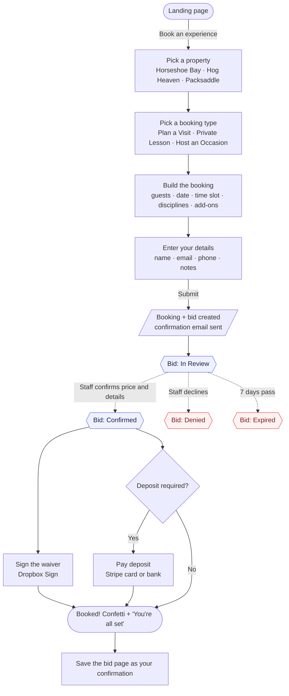
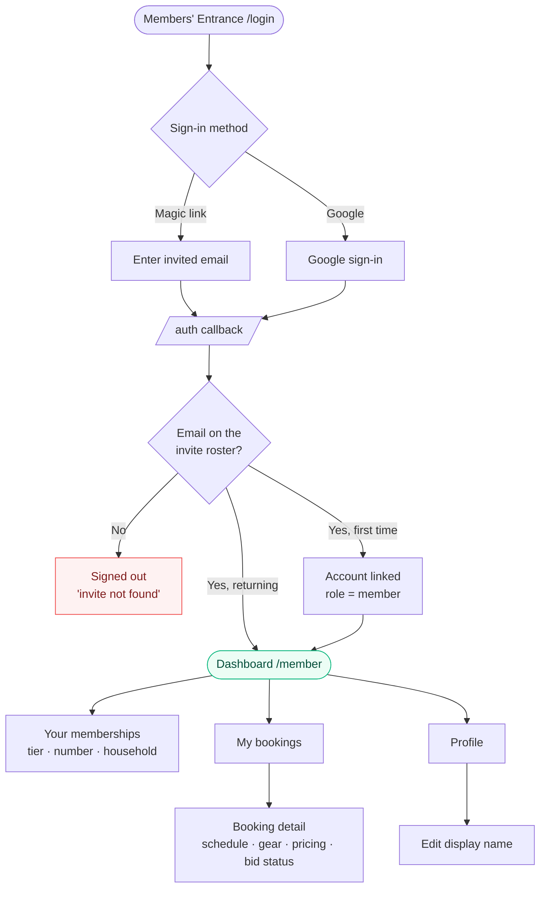
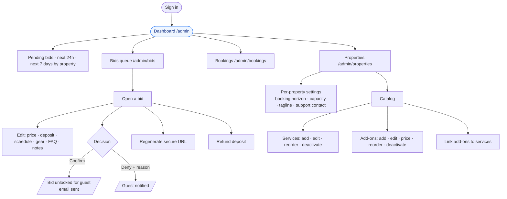
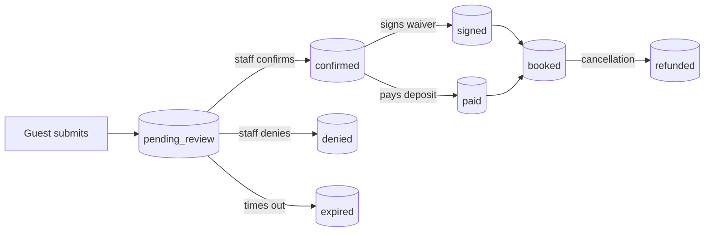

# Rhythm Outdoors — User Guide

*A practical manual for everyone who uses the Rhythm Outdoors platform: guests booking a visit, members managing their experiences, and staff running the day-to-day.*

---

## What Rhythm Outdoors Is

Rhythm Outdoors is a single web application that runs three outdoor sporting clubs from one place:

- **Horseshoe Bay Sporting Club**
- **Hog Heaven Sporting Club**
- **Packsaddle Precision**

One website, one backend, one database — but three different "front doors," called **portals**, each built for a different kind of person.

| Portal | Who it's for | What they do there |
|---|---|---|
| **Public** | Anyone on the internet — prospective guests | Browse, build a booking, sign a waiver, and pay a deposit |
| **Member** | Logged-in club members | See their memberships, household, and upcoming trips; edit their profile |
| **Admin** | Staff (five roles) | Review and price bids, manage bookings, configure properties and pricing |

### The one idea behind everything

> **Every inquiry should end as a signed bid page with a deposit already paid — no phone tag, no five tabs open, no spreadsheets.**

A guest tells us what they want, staff confirms the details and price, and the guest signs and pays on a single web page. That page becomes their confirmation and their reference for the trip.

### Words you'll see throughout this guide

| Term | What it means |
|---|---|
| **Booking** | A request to visit a property on a date — who's coming, what they'll do, for how long. |
| **Bid** | The page a guest receives for a booking. It holds the confirmed price, the schedule, the waiver, and the deposit. The bid is the thing a guest signs and pays. |
| **Discipline / Service** | An activity offered at a property (e.g. a shooting discipline, a lesson type). |
| **Add-on** | An optional extra attached to a service (e.g. an ammo package, a guide rental) with its own price. |
| **Booking type** | One of three formats: **Plan a Visit**, **Private Lesson**, or **Host an Occasion**. |
| **Deposit** | The amount a guest pays up front on the bid page to lock the date. The balance settles at the property. |
| **Waiver** | The liability document the guest signs electronically (via Dropbox Sign) before the visit. |
| **Property** | One of the three clubs. Each has its own services, prices, capacity, and booking window. |

---

## Table of Contents

1. [**For Guests** — booking, signing, and paying (Public portal)](#1-for-guests--public-portal)
   - 1.1 The guest journey at a glance
   - 1.2 Step-by-step: from landing page to confirmed trip
   - 1.3 What happens after you submit
   - 1.4 Signing and paying on the bid page
   - 1.5 Bid states you might see
2. [**For Members** — managing your account (Member portal)](#2-for-members--member-portal)
   - 2.1 The member journey at a glance
   - 2.2 Logging in
   - 2.3 Your dashboard and memberships
   - 2.4 Your bookings
   - 2.5 Editing your profile
3. [**For Staff** — running the platform (Admin portal)](#3-for-staff--admin-portal)
   - 3.1 The admin journey at a glance
   - 3.2 Who can sign in
   - 3.3 The dashboard
   - 3.4 Working a bid: review, price, confirm, send
   - 3.5 Bookings
   - 3.6 Property settings
   - 3.7 The catalog: services and add-ons
4. [**Reference**](#4-reference)
   - 4.1 Bid & booking status glossary
   - 4.2 How a booking moves through the system
   - 4.3 Frequently asked questions

---

## 1. For Guests — Public Portal

This is the experience for anyone visiting the website without logging in. No account is needed to book, sign, or pay.

### 1.1 The guest journey at a glance

### 1.2 Step-by-step: from landing page to confirmed trip

**Step 1 — Land.** The homepage explains the five-step promise (*Choose → Configure → Sign → Pay → Show up*). Tap **Book an experience**.

**Step 2 — Choose a property.** Pick one of the three clubs. Each card shows its name, location, and a short tagline (which staff can edit).

**Step 3 — Choose a booking type.** Three formats:

| Type | Best for | Length |
|---|---|---|
| **Plan a Visit** | Open range time, casual | ~2 hours |
| **Private Lesson** | One-on-one with an instructor | 1–3 hours |
| **Host an Occasion** | Exclusive use, tournaments, corporate days | 2–6 hours |

**Step 4 — Build the booking.** On one screen you:
- Set the **number of guests**.
- Pick a **date** (only dates within the property's booking window are offered).
- Pick a **time slot** — slots that are already full are greyed out (availability is checked live).
- Choose your **disciplines** and any **add-ons**.

A running summary on the side shows an estimated total as you go.

**Step 5 — Enter your details.** Name and email are required; phone and notes are optional. Tap **Submit Your Booking**.

### 1.3 What happens after you submit

The moment you submit, the system creates your booking and a **bid** in one atomic step, then sends you a confirmation email. You land on your personal **bid page** at a private link (a unique slug + access code — no login needed, but keep the link safe).

At first the bid shows **"In review."** Staff will confirm the details and final price — typically **within 24 hours** — and you'll get an email when your bid is ready to sign and pay.

> **Why the wait?** Pricing for some experiences is confirmed by a person, not a formula. This is the step where staff lock in your quote, schedule, gear list, and waiver.

### 1.4 Signing and paying on the bid page

Once staff confirm your bid, returning to your bid link unlocks the full page:

- Your **schedule** (arrival/wrap times, instructor if assigned)
- **What we'll bring** (gear list)
- **FAQ** and contact info
- A **Sign your waiver** section (opens the Dropbox Sign document in-page)
- A **Pay your deposit** section (if a deposit is required), powered by Stripe — card or bank transfer

**Both signing and paying are required to finalize**, and you can do them in either order. If a deposit isn't required, signing alone finalizes the booking. When both are done, the page celebrates — *"You're all set"* — and locks in your date. **Save this page; it's your confirmation and everything you need is on it.**

### 1.5 Bid states you might see

| State | What it means for you |
|---|---|
| **In review** | Submitted; staff are preparing your quote. Nothing to do yet. |
| **Confirmed** | Ready to sign and pay. |
| **Signed / Paid / Booked** | You've completed your part — you're set. |
| **Expired** | The bid sat unsigned/unpaid too long. Contact the team for a fresh one. |
| **Denied** | The booking couldn't be accommodated. Contact the team. |
| **Refunded** | A paid deposit was returned (e.g. a cancellation). |

---

## 2. For Members — Member Portal

The member portal is for people who belong to one of the clubs. Membership is **invite-only** — staff add you from the member roster, and you sign in with the email you were invited under.

### 2.1 The member journey at a glance

### 2.2 Logging in

Go to **/login** ("Members' Entrance"). Choose either:
- **Magic link** — enter your email; we send a one-tap sign-in link. No password.
- **Google** — sign in with your Google account.

Either way, **only invited emails work**. If your email isn't on the roster (or the invite expired), you'll be signed out with an "invite not found" message — reach out to staff to be added.

### 2.3 Your dashboard and memberships

After signing in you land on **/member**. The dashboard greets you and shows **Your memberships**. Each membership card shows:
- The **property** it's for
- Your **member number** and **tier**
- The **status** (e.g. active)
- Your **role** on it (e.g. primary)
- The **household** — other people who share the membership (name, email, role)

One person can belong to several memberships (across properties, or shared in a household), and they all appear here.

### 2.4 Your bookings

The **My bookings** tab lists every booking made by anyone in your household, across all your memberships. Each card shows the date/time, property, type, status, party size, and who booked it ("you" or a household member's name). Tap a booking to open its **detail page** — full guest info, schedule, gear list, FAQ, disciplines, add-ons, and the complete pricing breakdown (quote, deposit, amount paid, balance).

### 2.5 Editing your profile

The **Profile** tab lets you set your **display name** — the name the portal uses for you in the header, on membership cards, and as "booked by" on bookings. It's an app-only nickname; it doesn't change your login email or your Google name. (Names already captured on existing bids and bookings stay as they were.)

Sign out anytime with the **Sign out** button in the header.

---

## 3. For Staff — Admin Portal

The admin portal (**/admin**) is where staff run the platform: reviewing and pricing bids, watching upcoming events, and configuring each property's offerings and prices.

### 3.1 The admin journey at a glance

### 3.2 Who can sign in

Five staff roles have access to **/admin**: **super_admin, admin, property_manager, concierge, membership_coordinator**. (Admins intentionally do **not** have access to the member or partner portals — staff see member data through admin views, not by logging in as a member.)

### 3.3 The dashboard

The first screen gives an operations snapshot:
- **Pending review** count and the most recent bids waiting on staff
- **Confirmed bookings · next 24 hours**, grouped by property (today and tomorrow)
- **Upcoming · next 7 days**, one column per property

Everything is a link into the relevant detail page; the dashboard itself is read-only.

### 3.4 Working a bid: review, price, confirm, send

This is the core of the admin job. From the **Bids** queue (filter by status, property, date range, or search by guest), open a bid to see the full picture: booking details, guest contact, disciplines and add-ons, the pricing breakdown, the lifecycle timestamps, and internal staff notes.

**To prepare a bid for the guest, tap Edit and set:**
- **Confirmed quote** — the price the guest sees (overrides the auto-estimate)
- **Deposit** — the minimum due before the trip
- **Schedule notes**, a **gear list**, and **FAQ** entries
- **Staff notes** (internal only)

**Then act on the bid:**

| Action | When it's available | What it does |
|---|---|---|
| **Confirm** | Bid is in review | Unlocks the schedule, waiver, and deposit on the guest's bid page; emails the guest. |
| **Deny** | Bid is in review | Marks the bid denied with an internal reason; the guest is notified (they don't see the reason). |
| **Regenerate URL** | Active bids | Issues a new secure link and invalidates the old one (shown once — copy it). |
| **Refund deposit** | Deposit was paid | Returns the deposit to the guest's card via Stripe. |

> Always verify the price and bid content **before** confirming — confirming is what reveals it all to the guest.

### 3.5 Bookings

The **Bookings** list mirrors the bids list (same filters and columns) and is largely a read-only record. Most bookings have an associated bid; opening such a booking takes you straight to its bid, which is where the editing happens.

### 3.6 Property settings

**/admin/properties** shows one editable card per property. Staff can set:
- **Booking horizon** — how far ahead guests may book (1–365 days)
- **Max concurrent groups** — the capacity ceiling per slot
- **Tagline** — the one-liner on the public homepage
- **Support email / phone** — the contact shown to guests

Changes apply immediately to the public booking funnel.

### 3.7 The catalog: services and add-ons

Each property's **catalog** (**/admin/properties/[id]/catalog**) has two panels:

**Services** (the disciplines guests can book) — add, edit (name, description), reorder, or deactivate. Deactivating warns you about affected bookings first.

**Add-ons** (priced extras) — add, edit (name, description, **price**), reorder, or deactivate.

**Linking** — when editing a service, choose which add-ons are offered with it. You can even create new add-ons inline while editing a service. Catalog changes flow straight through to what guests see in the booking funnel.

---

## 4. Reference

### 4.1 Bid & booking status glossary

| Status | Meaning |
|---|---|
| **pending_review** | Submitted by a guest; awaiting staff pricing/confirmation. |
| **confirmed** | Staff approved and priced; guest can sign and pay. |
| **signed** | Waiver signed; deposit may still be owed. |
| **paid / booked** | Deposit paid and waiver signed — fully finalized. |
| **denied** | Staff could not accommodate the request. |
| **expired** | Sat unsigned/unpaid past the window (≈7 days). |
| **refunded** | A paid deposit was returned. |

### 4.2 How a booking moves through the system

The guest, the member, and the staff member each see the same booking from a different angle — the guest on their bid page, the member in *My bookings*, and staff in the admin bid detail. The database is the single source of truth they all read from.

### 4.3 Frequently asked questions

**Does a guest need an account to book?**
No. Booking, signing, and paying all happen on a private bid link without logging in.

**Why didn't a price show up instantly?**
Many experiences are priced by staff. The guest gets an estimate during booking; the confirmed quote arrives when staff confirm the bid (usually within 24 hours).

**How do members get access?**
By invitation only. Staff add the member's email to the roster; the member then signs in with that exact email via magic link or Google.

**Can an admin log in as a member?**
No. Staff view member data through admin screens, not by entering the member portal. This keeps each portal single-purpose and easy to secure.

**Where does pricing and availability actually live?**
In the database, which all three portals read from. HubSpot and other tools are downstream of it, never the source of truth.

---

*This guide describes the platform as built. For phase status and what's planned next, see `TRACKER.md` in the repository root.*
